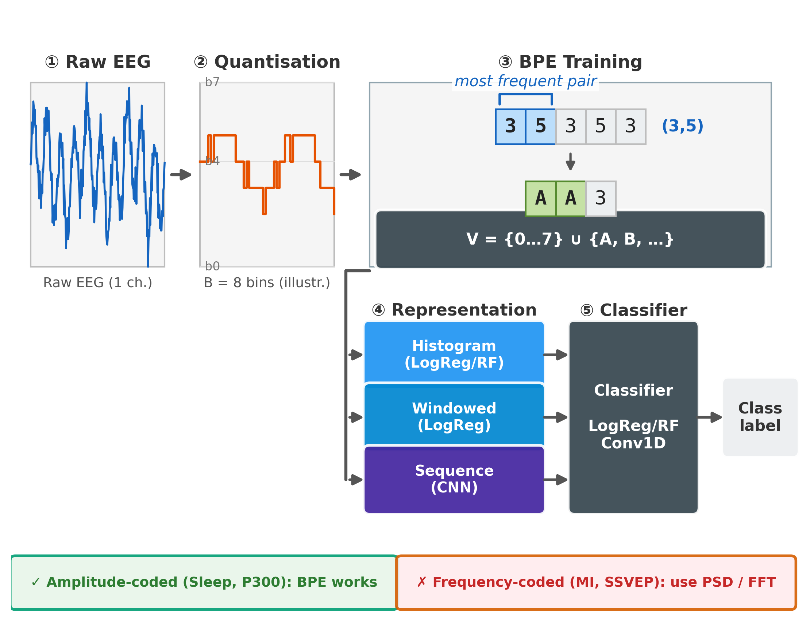
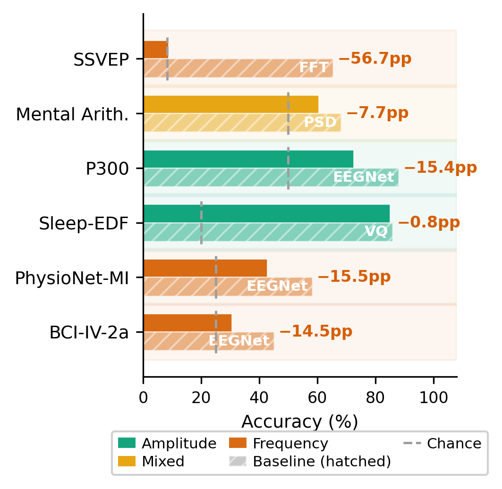
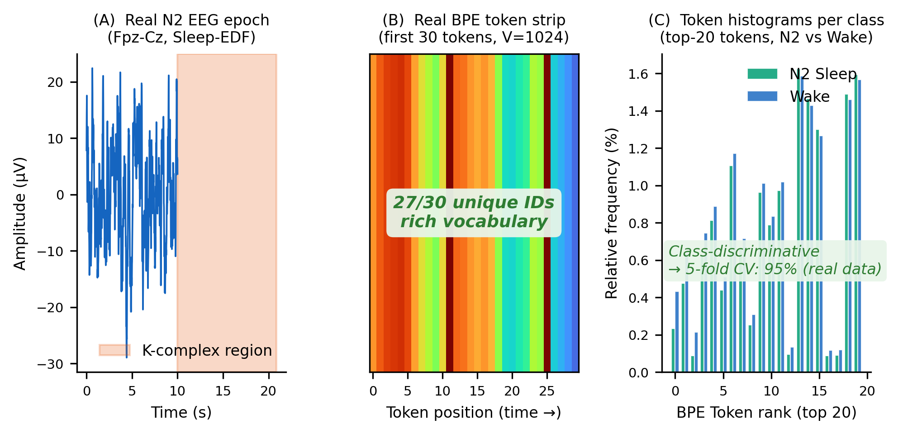
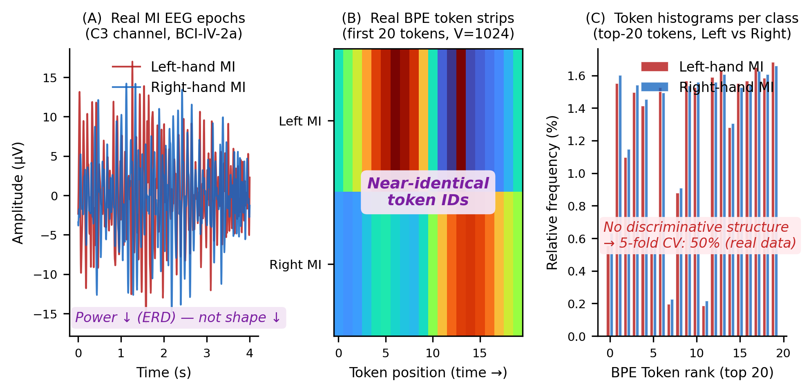
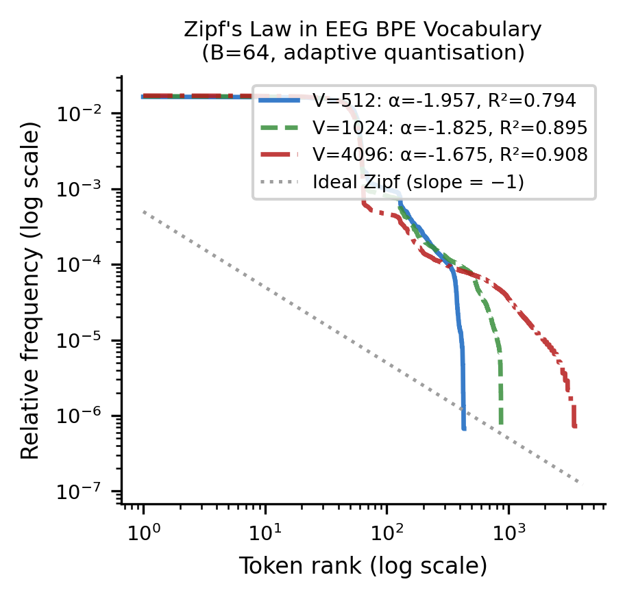
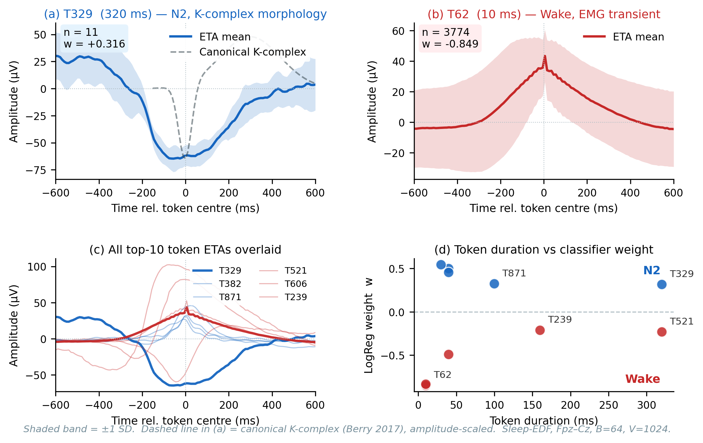

<div align="center">

# Waveform or Rhythm?
### A BPE Tokenisation Benchmark for EEG

<p>
  
  
  
  
  
  
</p>

<p><b>Nasybullin A. A., Kornaev A. V.</b> · Innopolis University · 2026</p>

<p>
  <i>Proceedings of the Southwest State University. Computer Science, Computer Engineering and Control</i><br/>
  <i>Известия ЮЗГУ. Серия: Информатика и вычислительная техника</i>
</p>

</div>

---

## TL;DR

BPE — the subword compression method that powers modern language models — can be applied verbatim to amplitude-quantised EEG. On six public brain–computer-interface datasets we find one clean rule:

> **BPE works when a paradigm encodes discriminative information in the *waveform*.**
> **BPE fails when the information lives in *spectral power modulation*.**

Sleep-EDF? BPE ≈ EEGNet. Motor imagery and SSVEP? Use PSD / FFT. That single distinction predicts every result in the paper.

---

## Method at a glance

<div align="center">
  <br/>
  <sub><b>Figure 1.</b> The five-step pipeline: <b>(1)</b> load raw EEG → <b>(2)</b> amplitude-quantise per channel (adaptive, <i>B</i>=64 by default) → <b>(3)</b> train BPE on the resulting integer stream (vocabulary <i>V</i>=4096, five random seeds) → <b>(4)</b> convert each trial to one of three token representations (histogram, sliding-window histogram, sequence) → <b>(5)</b> classify with LogReg, RF, Conv1D, or Channelwise Transformer.</sub>
</div>

---

## The one figure that tells the story

<div align="center">
  <br/>
  <sub><b>Figure 2.</b> Best BPE variant versus best baseline, per dataset. Blue = BPE competitive on amplitude-coded paradigms (Sleep-EDF, P300, Mental Arithmetic). Orange = BPE lags on frequency-coded paradigms (BCI-IV-2a, PhysioNet-MI, SSVEP). The gap tracks a single physiological property, not model capacity.</sub>
</div>

## Headline results

| Paradigm | Coding | Best BPE | κ | Best baseline | Gap |
|---|---|---|---|---|---|
| **Sleep-EDF** | amplitude | BPE_WindowedSeq_CNN **85.1%** | **0.688** | EEGNet 85.3% | **−0.2 pp** |
| **P300** | amplitude | BPE_Windowed_LogReg **72.6%** | 0.258 | EEGNet 88.0% | −15.4 pp |
| Mental Arithmetic | mixed | BPE_Windowed 59.5% | 0.189 | PSD 68.2% | −7.7 pp |
| BCI-IV-2a | frequency | BPE_WindowedSeq_CNN 30.6% | 0.074 | EEGNet 45.1% | −14.5 pp |
| PhysioNet-MI | frequency | BPE_Windowed_LogReg 42.7% | 0.236 | EEGNet 58.2% | −15.5 pp |
| SSVEP | frequency | all BPE ≈ chance | ≈0 | SSVEP-FFT 65.4% | **−56.7 pp** |

Cross-subject validation, 5 random seeds `[42, 123, 456, 789, 2024]`, cohort sizes 9–109 subjects. See `results/logs/exp2_downstream_results.csv` for the raw numbers.

---

## The amplitude/frequency dichotomy, side by side

<div align="center">
  <table>
    <tr>
      <td width="50%"></td>
      <td width="50%"></td>
    </tr>
    <tr>
      <td><sub><b>Sleep-EDF (amplitude paradigm).</b> BPE keeps pace with EEGNet on every stage. Discriminative structure lives in <b>waveform shape</b> — K-complexes, sleep spindles, slow oscillations — which is exactly what BPE's greedy merges capture.</sub></td>
      <td><sub><b>Motor imagery, BCI-IV-2a (frequency paradigm).</b> Every BPE variant lags PSD and CSP+LDA by 10–15 pp. Discriminative structure lives in <b>μ/β-band power modulation</b> (event-related desynchronisation) — a spectral quantity BPE is structurally blind to.</sub></td>
    </tr>
  </table>
</div>

---

## Extra findings

<table>
  <tr>
    <td width="55%" valign="top">
      <br/>
      <sub><b>Figure 6.</b> Token rank vs. frequency, log–log, for three vocabulary sizes on Sleep-EDF. The flat plateau (ranks 1–64) is the base amplitude alphabet; the steep tail is BPE merges. Power-law exponent α ≈ −1.83 (R² ≈ 0.895 at V=1024) — <b>the same long-tail structure as natural language</b>.</sub>
    </td>
    <td width="45%" valign="top">
      <br/>
      <sub><b>Figure 10.</b> Event-triggered averaging on the most weighted BPE token for N2 sleep. Without any neurophysiological priors, BPE recovers the textbook <b>K-complex morphology</b> (~500 ms biphasic deflection). The tokeniser learns the same waveforms clinicians label.</sub>
    </td>
  </tr>
</table>

Three more things worth noting:

- **Merges carry real information.** Ablation A7 (Sleep-EDF): BPE adds **+18.0 pp** over raw amplitude bins and **+5.9 pp** over random merges — the merge order is not a wash.
- **PhysioNet-MI is a surprise.** Despite being a "frequency" paradigm, BPE_Windowed_LogReg reaches κ = 0.236 (accuracy 42.7%), the second-best method. The mechanism is likely spatial-transient artefacts BPE picks up alongside the spectral content.
- **BPE + PSD is not additive.** A K7 ensemble of BPE_Windowed and PSD on Mental Arithmetic reaches 68.3% — vs. 68.2% for PSD alone. When the frequency signal is strong, the amplitude channel has nothing new to say.

---

## Repository layout

```
.
├── LICENSE                     MIT
├── pyproject.toml              package metadata (eeg-bpe v1.0.0)
├── requirements.txt            pip dependencies
├── CITATION.cff                citation info
├── eeg_bpe/                    experiment code (26 .py files)
│   ├── bpe_engine.py           BPE train/apply (doubly-linked list + max-heap, O(n log n))
│   ├── quantization.py         adaptive / uniform / μ-law quantisers
│   ├── data_loading.py         6 dataset loaders + disk/memory cache
│   ├── classifiers.py          Conv1D, Transformer, ChannelwiseTransformer, WindHistCNN
│   ├── baselines.py            EEGNet, CSP+LDA, PSD, VQ, SSVEP-FFT, Patching, Chronos
│   ├── exp2_downstream.py      main classification experiment
│   ├── ablations.py            A1–A15 ablation runners
│   ├── config.py               constants: seeds, batch sizes, defaults
│   └── run_all.py              master runner
├── scripts/                    result-processing scripts
├── results/logs/               experiment result CSVs + JSONs (134 files)
├── data_download/              dataset download scripts (raw data NOT bundled)
├── images/                     figures reused in this README
└── CONTRIBUTING.md
```

---

## Reproducing the experiments

### Prerequisites

- Python 3.10 / 3.11 / 3.12
- MNE-Python, NumPy, SciPy, pandas, scikit-learn, PyTorch, statsmodels
- One CUDA GPU strongly recommended (all experiments were run on an **RTX 5070 Ti**)

```bash
pip install -e .              # installs the eeg_bpe package
# or:
pip install -r requirements.txt
```

### Download datasets

```bash
python -m data_download.download_bci_iv_2a
python -m data_download.download_physionet_mi
python -m data_download.download_sleep_edf
python -m data_download.download_epfl_p300
python -m data_download.download_mental_arithmetic
python -m data_download.download_ssvep_nakanishi
# or all at once:
python -m data_download.download_all
```

Datasets total ~12 GB; Sleep-EDF and PhysioNet-MI are the biggest.

### Quick smoke test (3 subjects · V=1024 · single seed)

```bash
python -m eeg_bpe.run_all --quick
```

Warm-run < 5 min on RTX 5070 Ti; cold-run ~3 h.

### Full benchmark (all subjects · V=4096 · 5 seeds)

```bash
python -m eeg_bpe.run_all
```

Wall time on RTX 5070 Ti: **4–8 hours**. Random seeds `[42, 123, 456, 789, 2024]`.

### Ablations and extensions

```bash
python -m eeg_bpe.ablations --all            # A1–A15 + K7 ensemble
python -m eeg_bpe.exp6_alt_tokenization      # alternative preprocessors
python -m eeg_bpe.exp8_csp_bpe               # CSP + BPE extension
python -m eeg_bpe.exp9_spatial_bpe           # spatial-BPE via k-means
```

Result CSVs land in `results/logs/ablation_A*.csv` and are consumed by
`scripts/generate_results_tables.py`.

### Aggregate result tables

```bash
python scripts/generate_results_tables.py
python scripts/key_findings.py
```

---

## Datasets used (all public)

| Dataset | Paradigm | Subjects | Reference |
|---|---|---|---|
| BCI-IV-2a | Motor imagery | 9 | Brunner et al. 2008 (Graz TU tech report) |
| PhysioNet-MI | Motor imagery | 109 | [10.1161/01.CIR.101.23.e215](https://doi.org/10.1161/01.CIR.101.23.e215) |
| Sleep-EDF | Sleep staging | 20 of 78 | [10.1109/10.867928](https://doi.org/10.1109/10.867928) |
| BNCI P300 | P300 ERP | 10 | [10.1016/j.jneumeth.2007.03.005](https://doi.org/10.1016/j.jneumeth.2007.03.005) |
| Mental Arithmetic | Mental load | 36 | [10.3390/data4010014](https://doi.org/10.3390/data4010014) |
| SSVEP | Steady-state VEP | 9 | [10.1109/TBME.2017.2694818](https://doi.org/10.1109/TBME.2017.2694818) |

Total: **193 subjects across 6 datasets and 5 paradigm types.**

---

## Cite as

```bibtex
@article{nasybullin2026waveform,
  title   = {Waveform or rhythm: {BPE} tokenisation benchmark for {EEG}},
  author  = {Nasybullin, Albert A. and Kornaev, Alexey V.},
  journal = {Proceedings of the Southwest State University.
             Computer Science, Computer Engineering and Control
             = {Izvestiya Yugo-Zapadnogo gosudarstvennogo universiteta}},
  year    = {2026}
}
```

See also [`CITATION.cff`](CITATION.cff).

---

## Contact

- Albert Nasybullin — `a.nasibullin@innopolis.university` — [ORCID 0009-0000-7265-4378](https://orcid.org/0009-0000-7265-4378)
- Alexey Kornaev — `a.kornaev@innopolis.ru` — [ORCID 0000-0001-5121-6045](https://orcid.org/0000-0001-5121-6045)

Innopolis University · Innopolis · Republic of Tatarstan · Russia

## License

MIT — see [LICENSE](LICENSE).
